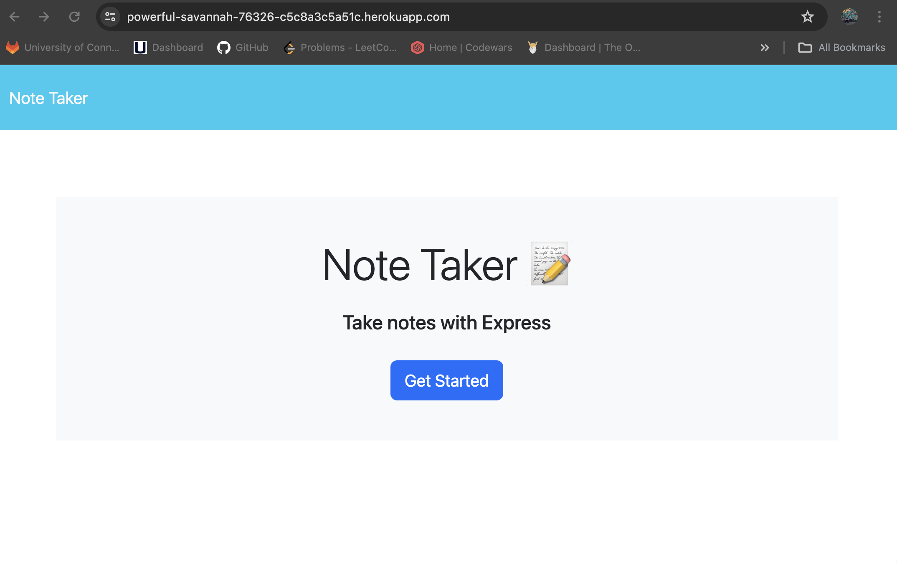
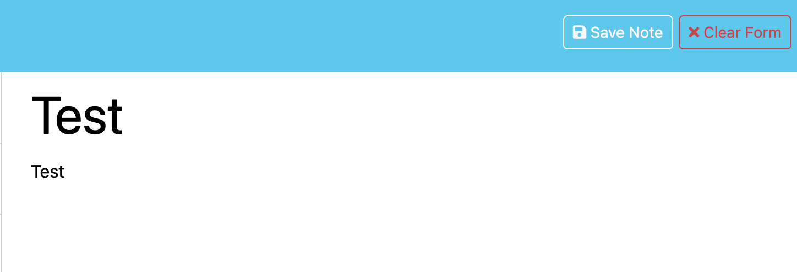
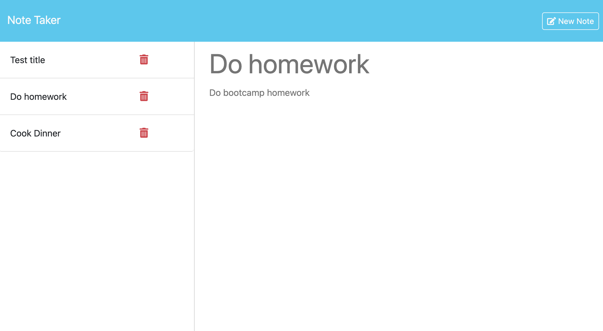

# Note Taker Starter Code
  
  ##### Table of Contents  
  [Description](#description)  
  [Installation](#installation)  
  [Usage](#usage)  
  [Contributions](#contributions)  
  [Tests](#tests)  
  [Questions](#questions)  
  [License](#license)  

  ## Description  
  This project was created to help users write and save notes for future use. The application utilizes the Express framework and uses api routes to access a database that stores the users notes. 

  ## Installation  
  N/A
  

  ## Usage  
  To use the application navigate to https://powerful-savannah-76326-c5c8a3c5a51c.herokuapp.com/

  

  Click the ```Get Started``` button to navigate to the notes page. Fill in the 'Note Title' and 'Note Text' areas. Once text is input in both areas, ```Save Note``` and ```Clear Form``` buttons will appear in the top right of the page. 
  
  


  Once the ```Save Note``` button is clicked, the note will be added to the notes list on the left, and the text areas will be returned to their default placeholders. To access previous notes, click on a note title in the list on the left side of the page. The main text area will be populated with the stored note data. Clicking on the trash can icon will permananetly delete the note from both the list and from the database.

  

  ## Contributions  
  Github user [Xandromus](https://github.com/Xandromus): [Starter Code Repo](https://github.com/coding-boot-camp/miniature-eureka)

  GitLab User [integration](https://git.bootcampcontent.com/integration): [UUID Function](https://git.bootcampcontent.com/University-of-Connecticut/CONN-VIRT-FSF-PT-01-2024-U-LOLC/-/tree/main/11-Express/01-Activities/20-Stu_Data-Persistence/Unsolved/helpers?ref_type=heads)


  ## Tests  
  N/A


  ## Questions
  For any questions regarding the repository, contact me via:
  * Github: [dgomie](https://www.github.com/dgomie)
  * Email: <a href="mailto:danny.f.gomez@gmail.com">danny.f.gomez@gmail.com</a>
  
  ## License
    
   